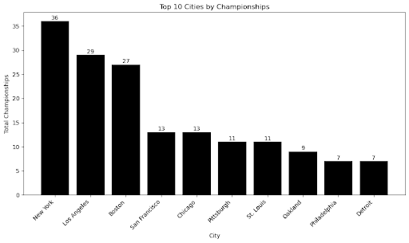
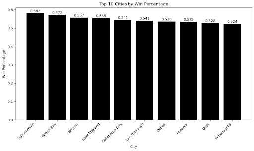
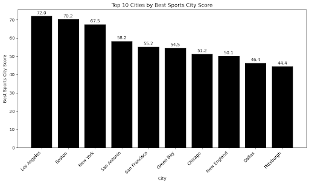

# Best Sports City in America: A Cross-League Analysis of MLB, NFL, and NBA

## **Contributors:**
- Rannin Gruen
- Jaedon Lager
- Arjun Sivasankaran

## **Summary:**

The goal of this project is to analyze sports performance across three major North-American sports leagues. This is Major League Baseball, the National Football League, and the National Basketball Association. We are doing this to determine which city demonstrated the strongest sports success over the past twenty years. While championship wins usually are the dominant force in many sports conversations, continued success across multiple leagues is not studied often. Our goal is to create a broader and more data-driven measure of city-level sports success by combining team performance data from different leagues into one complete dataset.

The motivation for this project comes from the idea that there are certain hubs in North America that are known for building strong sports hubs. Their fan bases and sports cultures can be seen as significantly stronger than other areas. One example is the dominant Boston, known for the Patriots, Celtics, and the Red Sox. Places like Boston are seen as elite sports markets, but those claims are typically from a place of opinion or recency bias, such as a strong championship run. By using historical data that contains objective metrics, we are looking to evaluate if these reputations are supported by results. We are also able to find insights that may not be readily seen without merging datasets from the three major sports.

For this analysis, we are using three datasets from publicly available sources. The NFL data came from Pro Football Reference, the NBA data from Basketball Reference, and the MLB data was obtained from Baseball Reference. These datasets contain team-level stats such as wins, losses, seasonal performance, and playoff appearances. Since the datasets are from different sources that have different structures, we will need to clean the data heavily in order to integrate them for meaningful insights. For data preparation, we are looking to clean any inconsistent column names, standardizing team and city labels, filtering records for records from the 1900s and on, and resolving any other issues that may arise during the cleaning process. We are going to use normalized metrics when merging the three leagues together, in order to ensure no bias to any one sport.

After cleaning and standardization, the three datasets are merged using city as a shared attribute. Once the dataset is integrated, we are able to compare cities based on combined success for the teams across all three leagues. This way, we will be able to evaluate overall consistency and some standout periods of success, like which sports contribute most to a city’s sports reputation, and whether or not a specific region in the USA performs better. As for extra cleaning, we made sure to only use data from the teams existing in 1900s and on, to be consistent throughout sports.

Through this project, we expect to create a ranked view on the strongest cities for sports based on real, objective results, rather than opinion. As this project requires a big merge and cleaning, we expect to learn real skills of documentation, cleaning, ethical data handling, and creating reproducible work. It demonstrates how using multiple different data sources and putting them all together can create strong insights and turn into a meaningful project.

## **Data Profile:**

For this specific project, we used three datasets that contain historical team performance for the MLB, NBA, and NFL. We chose these datasets because they provide key data and objective measures of historical team performance that can be compared across cities and locations. The central goal for these datasets after integration is to determine the city with the most sports success.

The raw data is stored in the GitHub repository as:

- `data/raw/mlb.csv`
- `data/raw/nba.csv`
- `data/raw/nfl.csv`

The cleaned data is stored in the GitHub repository as:

- `data/raw/mlb_cleaned.csv`
- `data/raw/nba_cleaned.csv`
- `data/raw/nfl_cleaned.csv`

The final merged dataset is stored under:

- `data/processed/city_sports_merged.csv`

1. **MLB Dataset**  

   a. **File Name:** `data/raw/mlb.csv`  
   b. **Original Source:** Baseball-Reference  
   c. **Structure:** The MLB dataset is a structured CSV file where each row represents a team’s franchise. It contains cumulative statistics. Some of the column names are Team Name, Playoff Appearances, etc.  
   d. **Content:** This dataset contains information all the way from the 1900s. It contains one row per team. This provides a lot more information from short lengths within the data, including data from active and inactive teams.  
   e. **Relation to Questions:** The MLB dataset contains all the data for the baseball teams per city, contributing an important factor to determining each overall cities’ success in sports. This dataset can also have some important insights into sustained success over periods of times, for a city.  
   f. **Ethical/Legal Constraints:** The data contains all public sports statistics, no proprietary or copyrighted information. It’s appropriate for use with proper citation.  

3. **NBA Dataset**  

   a. **File Name:** `data/raw/nba.csv`  
   b. **Original Source:** Basketball-Reference  
   c. **Structure:** This is also a structured CSV file containing franchise-level historical stats. Each row represents a team franchise, with cumulative and historical statistics. Some column names are: Team Name, Playoff Appearances, Seasons Played.  
   d. **Content:** The NBA dataset is from a similar source as the MLB dataset. It focuses more on franchise history than a team’s individual seasons. It includes active teams as well as potential teams that are not existing anymore.  
   e. **Relation to Questions:** For our analysis, a team's individual seasons are not necessary, so the NBA dataset we have will do. We would’ve potentially gained some more insights, but it was not necessary. Basketball performance is a huge measure of a city’s success from sports.  
   f. **Ethical/Legal Constraints:** All the information is publicly available team data. It is free to use for any academic use, and contains no sensitive data. We can use the dataset with proper citation.  

4. **NFL Dataset**  

   a. **File Name:** `data/raw/nfl.csv`  
   b. **Original Source:** Pro-Football-Reference  
   c. **Structure:** This dataset is also a structured CSV file and it contains franchise-level info about all of the NFL teams. Like the NBA dataset, this CSV has rows that represent teams, rather than individual seasons.  
   d. **Content:** This dataset summarizes the historical success of the NFL franchises and has indicators of the regular season performance. Since the number of NFL games played per season is lower than MLB or NBA, raw win totals will need further interpretation.  
   e. **Relation to Questions:** The NFL dataset contributes football performance to the city-level ranking that we are aiming to do, which is a big indicator of success in sports for a city. NFL success often has a major impact on people’s perception of a cities’ success due to how popular the NFL is.  
   f. **Ethical/Legal Constraints:** All information is publicly available team data. It is free to use for any academic use, and it contains no sensitive data. We can use this dataset with proper citation.
## **Data Quality:**

For our data quality analysis, we will be using the six dimensions of data quality in order to properly assess our quality. This is based on completeness, consistency, timeliness, validity, and uniqueness. Accuracy was accounted for, as these datasets are from a highly reliable source.

1. **Completeness** for all the datasets was overall very high. Core performance variables such as team names, wins, losses and seasons were all present. Some potential gaps were:  
   a. Missing city name in some of the sources  
   b. Franchises joining later vs. earlier (see below)  
   c. Mitigating for historical vs modern franchises  

- In order to mitigate these potential issues, we added city fields if necessary and filtered all records to the average score across their periods. For franchises joining later vs. earlier, we will need to be more careful of playoff appearance stats.

2. **Consistency** was a major challenge for merging the two datasets. One screaming example of this is with the ways the different data sets recorded wins and losses. For the NFL and the NBA datasets, you could see that the wins and losses were recorded as `W` or `L`. In the MLB dataset, it was `wins_total`. Another issue was team names containing potential semantic ambiguity, due to the use of abbreviations. 
- In order to resolve this, we standardized names for a team to just be a state. We also ensured to validate based on truth and trusted databases to standardize all other metrics, such as wins, losses, playoff appearances, and championships.

3. **Validity** was an issue to standardize across league game amounts. For example, season lengths for the NFL were vastly different from MLB or NBA games. For that reason, we couldn’t use raw win totals as a comparison metric. We therefore decided to use a normalized metric such as playoff qualifications, championships, and win percentages. It’s still important to keep total wins, but cannot be used to compare sport to sport. This ensures fair cross-sport comparisons.

4. **Uniqueness** didn’t seem to be an issue, as the dataset is smaller and duplicate observations are easily avoidable. The only issue we wanted to mitigate in terms of uniqueness was potential city relocations causing team name repeatedness. For example, the Charlotte Bobcats and the Hornets. 
- For that, we are merging by city and continuing to keep it as a talent based on location study.

5. **Timeliness** was not an issue except for the difference in historical franchises vs newly-found teams. 
- To mitigate that was quite simple, all that needed to be done was to base our analysis on playoff appearances as a percentage of seasons. There was no cleaning necessary for the dataset itself.

	After cleaning and any other transformation, our datasets were high quality enough to run any analysis we needed. The biggest issues with our specific datasets were the structural differences of each of them, and having to merge the different sources. Once we standardized the three datasets, they provided a stronger foundation for any necessary analysis. The final merged dataset is called `city_sports_merged.csv`. It supports visualization.

## **Data Cleaning:**
Our group performed extensive data cleaning across all three datasets to prepare them for integration and visualization. Although the datasets were sourced from the same website, they contained differences in player-level data and sport-specific statistics, which created inconsistencies across files. To build a cohesive and dynamic merged dataset, we used OpenRefine to standardize and align the data for analysis. A key part of this process involved renaming columns so they were consistent across datasets, as well as removing fields that did not align or contribute meaningfully to our objective. Because our focus was on analyzing the success of cities, we prioritized team-level data and removed player-specific or irrelevant statistics that did not support this goal. This allowed us to create a more streamlined dataset tailored to our analysis. Below is a breakdown of how each dataset was cleaned, followed by the steps we took to merge them into a single dataset.

**NFL Dataset Cleaning**
The NFL dataset we collected included both team-level statistics and individual player data. The first step in cleaning this dataset was to remove columns that were not relevant to evaluating team success. Specifically, we removed all columns under the “Top Performers” section, including “AV,” “Passer,” “Rusher,” “Receiving,” and “Coaching.” In addition, we removed the playoff columns “W,” “L,” “W-L%,” and “Chmp,” as these metrics were either redundant or already captured elsewhere in the dataset.

Next, we restructured the dataset so that each team was represented by a single row. The raw data included both current team names and historical franchise names, resulting in multiple rows per team. Because the top row for each team represented the aggregate of its subsections, we removed all subsection rows and retained only the summary row for each team. This resulted in a clean dataset of 32 rows, corresponding to the 32 current NFL teams.

We then split the original “Team” column into two separate columns: “City” and “Team_Name.” This step was important for our later analysis, as it allowed us to group and compare performance at the city level. After finalizing the rows and columns, we standardized the column names to ensure consistency across all datasets and to support a smooth merge process. The columns “From,” “To,” “W,” and “L” remained unchanged. The remaining columns were renamed as follows to improve clarity and reproducibility:

-   “W-L%” → “Win_Percentage”
    
-   “Yrs” → “Years_in_Playoffs”
    
-   “SBwl” → “Championships”
    
-   “Conf” → “Championships_Conference”
    
-   “Div” → “Championships_Division”
    

After completing these steps, the NFL dataset was fully prepared for merging.

**MLB Dataset Cleaning**
The MLB dataset followed a similar cleaning process to ensure consistency across all datasets. Initially, the dataset contained both team-level and individual player statistics, so we removed columns that were not relevant to evaluating team success. These included columns such as “Players,” “HOF#,” and various performance metrics like "R ","A ","H ","HR”, "BA ","RA ", and “ERA,” as they focused on individual or game-level statistics rather than overall team success. Additional columns such as “G>.500”, “Rk,” and “G” were also removed due to irrelevance or redundancy.

Next, we split the “Franchise” column into two separate columns: “City” and “Team_Name.” This was done using OpenRefine expressions to isolate the city name and team name, allowing for easier grouping and analysis at the city level. The original “Franchise” column was then removed.

After restructuring the columns, we filtered the dataset to include only current teams. Using OpenRefine’s star and flag features, we identified and marked the rows corresponding to current franchises, similar to the approach used in the NFL dataset. We then removed all unmarked rows, eliminating historical or duplicate franchise entries and ensuring each team was represented by a single row.

After refining the rows, we standardized the column names to match the structure used in the other datasets. The columns were renamed as follows to improve clarity and ensure consistency across datasets:

-   “W-L%” → “Win_Percentage”
    
-   “Playoffs” → “Years_in_Playoffs”
    
-   “WS” → “Championships”
    
-   “Pnnts” → “Championships_Conference”
    
-   “Divs” → “Championships_Division”
    

After completing these steps, the MLB dataset was fully cleaned and aligned with the NFL dataset, making it ready for merging.

**NBA Dataset Cleaning**
The NBA dataset followed a similar cleaning process to ensure consistency across all datasets. Unlike the NFL and MLB datasets, the NBA data already consisted of team-level statistics, so no individual player data needed to be removed. However, we still removed columns that were not relevant to evaluating team success. Columns such as “Yrs” and “G” were eliminated due to redundancy or lack of relevance to our analysis.

Next, we split the “Team” column into two separate columns: “City” and “Team_Name.” This was done using OpenRefine expressions to isolate the city name and team name, allowing for easier grouping and comparison at the city level. After creating these new columns, the original “Team” column was removed. We also removed the “League” column, as it was not necessary for our analysis.

After restructuring the columns, we filtered the dataset to include only current teams. Using OpenRefine’s star and flag features, we identified and marked rows corresponding to active franchises, similar to how subsections were handled in the NFL dataset. We then removed unmarked rows to eliminate outdated or duplicate team entries, ensuring that each current team was represented by a single row.

Finally, we standardized the column names to align with the structure used in the other datasets. The columns were renamed as follows to improve clarity and ensure consistency:

-   “Champ” → “Championships”
    
-   “Conf” → “Championships_Conference”
    
-   “Div” → “Championships_Division”
    
-   “Plyfs” → “Years_in_Playoffs”
    
-   “W/L%” → “Win_Percentage”
    

All datasets were ready for merge after this data cleaning.

## Data Integration
After using OpenRefine, we used python to integrate the 3 datasets, which was fairly easy since every column matched up with each other. Everything matched up and the new dataset is ready for analysis of visualization.

## Findings
For the findings section, we wanted to split our analysis into three separate categories. We did this because there is not one true metric that determines the “best” sports city. We started with the simplest way to measure sports success, the total number of championships for the city. The visual can be seen below, titled “Top 10 Cities by Championships”. The second analysis we ran was based purely on win percentage, which evens the playing field for cities that have fewer professional sports teams. The visual for this analysis is titled “Top 10 Cities by Win Percentage.” The last analysis we did combined all of these factors and assigned a point total to each column to get our opinion of the truly most successful sports city. We included all of the metrics, including win percentage, championships, years in playoffs, conference championships, and division championships. This gives a more holistic view into the strongest cities for sports, and the weightings can be adjusted based on what you view as most important for sports success in the city. Beneath each analysis is a more in-depth description of what the visual displays and why this is the case.

**Top 10 Cities by Championships:**
This visual assesses each city by its total number of championships. As seen in the bar charts, New York is dominant and carries 36 total championships across the three major sports. A reason for this is that they hold multiple teams in some sports, and most of their teams have been around for a historically long time. This, combined with the fact that they have had many strong dynasties across the major sports, resulting in many championships in a small period of time, makes it no surprise that they are at the top. Los Angeles and Boston appear to be the only other cities relatively close to New York, with 29 and 27 championships, respectively.

**Top 10 Cities by Win Percentage:**
This visual shows the top 10 cities based on their win percentage. The way the win percentage was calculated is by averaging the win percentage of all of the city’s sports teams. We did this so that each sport is weighed equally, rather than being skewed toward an older sport with a higher total number of games played. As seen in the visual, San Antonio and Green Bay are the top two cities for win percentage. Both of these cities actually only have one professional sports team, and this highlights the success that those individual franchises have had. Cities like Chicago, Los Angeles, and New York are dragged down by the number of different franchises that they have. In those cases, a team with a strong all-time win percentage can be affected by a different sport with a worse win percentage. One city that sticks out to me is Boston, as they are third in total championships and third in win percentage, showing that not only do they have a lot of teams with success, but every team is historically good.

**Top 10 Cities by Best Sports City Score:**
This analysis created a score for each city based on win percentage, championships, conference championships, division championships, and years in the playoffs. The analysis first gives a 0-100 rating of each city for every column that we are factoring in. Then, a weighting system is used to find the balance we wanted to find the best overall sports city. We used a weighting of .5, .2, .1, .1, .1, respectively, because we wanted win percentage (first column) and playoff success (represented by the remaining columns) to have an equal weighting cumulatively. This analysis finds that Los Angeles, Boston, and New York are the three best cities for sports. This checks out with a lot of articles online that have similar findings. These cities have a large number of professional teams that have all experienced success.

## Future Work
One major lesson we learned is that comparing sports cities is more complicated than just adding up win totals and playoff appearances. Initially, we thought that this would be a more simple comparison just from seeing what teams were the most successful from a raw total perspective for the NFL, NBA and MLB. After diving super deep into the datasets and understanding what the data represented, we realized it wouldn’t be that simple. Merging the datasets proved to show that comparison would be harder than initially expected. For example, the MLB plays way more games than the NBA, and the NBA plays more games than the NFL. This taught us that when analyzing certain datasets, raw totals can be misleading for comparison when doing analysis.

Another lesson that we learned while doing this project is the importance of cleaning datasets during merge to make sure we do analysis properly. The sources were from very similar websites, coming from one parent group, however they had different titles for certain key factors due to the differences from sport to sport. Cities were inconsistently listed when teams switched. For example, initially the team names for Chicago and Boston were Sox. This was an issue in cleaning that we had to double check and verify to mitigate. This basically showed us that data merging isn’t just combining datasets and leaving it. It includes making sure that key variables were congruent. Without this, doing any visualization would be inaccurate.

We learned that franchise age has a major weight for the success of any of the teams. Older teams can be seen as more institutional, having stronger success due to factors and metrics that are harder to track (fan-based, development). Older teams have higher raw wins and losses than new teams. This introduces a historical bias when using raw totals. In any future work, we would normalize these statistics to be more reasonable when comparing, one being wins per season or winning percentage. Introducing these certain metrics would allow for fairer comparison between older and newer franchises.

One area for future work could be incorporating more sports. Our dataset focused on three major sports, baseball, basketball and football. However there are big leagues that also have major effects on cities sports outcomes. NHL, MLS, WNBA are all big leagues in sports. Including these leagues could have a big effect on the outcome of the strongest sports city. Cities like St. Louis, Pittsburgh, etc. have strong teams in these divisions that are not included. College sports are also becoming a big indicator of strong sports cities.

Another area for future work could be including other metrics with datasets. These metrics would be fan-based or market data. For example, which city has the strongest sports spirit? Which city sells the most team merch? These are all typically important metrics for how strong a city is relating to sports. It can also provide key ideas on whether or not a city has funding to be a good sports team. If a city sells more merchandise, they have more money to invest in talent, and therefore win games. It could be good to understand the bigger picture.

Another metric that can be used in congruence is seeing the effect of how much a strong sports team affects people’s choice to move or live in those areas. A lot of people enjoy sports a lot and that can play a big factor on where they choose to live. This can be scraped from survey data more than actual hard data, but could be an interesting topic to analyze.

## Challenges
We encountered a couple of issues while integrating and analyzing the dataset. From the core of the dataset, there are some differences inherently with the leagues that we needed to mitigate. From the league perspective, the playoff structure for the three sports are all different. The NBA has more games played for the finals than in football. The MLB plays even more games (162). We decided that since the sports playoffs are congruent for the entire league that the team is in, it can resemble how good people are at that sport, and doesn’t need to be congruent for the analysis we need.

Another issue we encountered was different franchises starting at different times. For example, the Houston Texans were introduced in 2002, whereas the New York Giants in 1925. This can cause issues with fairness and comparability, when comparing certain raw totals like wins or losses. Newer teams may appear less successful when comparing that. For that reason, we included and conducted analysis on the team's winning percentages in order to show the full picture. Teams that were newly introduced will be compared on their own percentages so that it can be closer compared to teams that have been there for years.

We also understood that there might be accuracy issues for teams that were introduced decades ago, from a documentation perspective. However, we are taking that as something that can’t be mitigated, as these are the strongest sources for the data from those years. While there might be some differences from the actual data, we have no way to verify whether that older data is inaccurate or not.

Going into data cleaning, one issue we saw was that certain teams changed locations. For example, the Brooklyn Dodgers became the LA Dodgers. The New York Nets became the Brooklyn nets, etc. For that, the dataset we were provided made it easy to clean this. Under the most recent team names, it showed what other cities had that team name. We decided to group it to the most recent city, as talent just moved over to those new cities as well. It was an easily mitigable issue.

An issue during the cleaning was making sure to properly enter team names. In our initial cleaned set, we decided to put a team name (EX: Portland Trail Blazers) and separate the last word as the team name, and the rest as the city (EX: Name: Blazers, City: Portland Trail). For most teams, like the Los Angeles Lakers, this worked fine. But for the EX I mentioned, certain teams were incorrectly grouped. Portland Trail isn’t the city, it’s just Portland. Since this issue only occurred very few times, we decided to manually check and edit this. We encountered this for the Portland Trail Blazers, Boston Red Sox, Chicago White Sox, etc. We easily mitigated this.

## Reproducibility
In order to reproduce this project, a user should follow the steps provided-.

  

1.  Download the three datasets that were used in the project
    

-   MLB Dataset from Baseball-Reference
    
-   NBA Dataset from Basketball-Reference
    
-   NFL Dataset from Pro-Football-Reference
    

Save all files in the ‘raw_data’ folder as

-   /mlb.csv
    
-   /nba.csv
    
-   /nfl.csv
    

2.  Generate SHA-256 checksums for the raw datasets to ensure file integrity
    
3.  OpenRefine was used to clean and standardize each dataset. To ensure reproducibility, we provide exported OpenRefine operation history files located in the /data_quality_and_cleaning.For each dataset:
    

1.  Open OpenRefine and create a new project by importing the corresponding raw dataset from the /raw_data folder
    

-   mlb.csv
    
-   nba.csv
    
-   nfl.csv
    

3.  Apply the appropriate operation history file:
    

-   mlb_history_OR.json
    
-   nba_history_OR.json
    
-   nfl_history_OR.json
    

5.  This will automatically perform all cleaning steps, including:  
      
    

-   Removing irrelevant or player-level columns
    
-   Filtering to retain only current team/franchise summary rows
    
-   Splitting franchise/team names into City and Team_Name columns
    
-   Standardizing column names across datasets
    
-   Applying any necessary data corrections
    

7.  After applying the operation history, export each cleaned dataset as a CSV file and save it in the /cleaned_data folder as:
    

-   mlb_cleaned.csv
    
-   nba_cleaned.csv
    
-   nfl_cleaned.csv
    

4.  Open the python integration notebook in VSCode. Ensure that you have pandas and matplotlib installed.
    
5.  Read in the cleaned datasets as nba, mlb, and nfl for their respective datasets.
    
6.  Merge the three datasets. Use the following code, which is found in the Integration json file
    

-   datasets_merged = pd.concat([nfl, nba, mlb])
    

7.  Export to a csv as the final merged dataset, which is also found in the Integration json file using the following code.
    

-   datasets_merged.to_csv("city-sports-merged.csv")
    

8.  Use the final merged dataset, city-sports-merged.csv in order to reproduce the visualizations. Utilize the Visualizations json to reproduce the exact visuals we created. The three visualizations we created were:
    

-   Top 10 Cities by Championships
    
-   Top 10 Cities by Win Percentage
    
-   Top 10 Cities by Best Sports City Scores
    

9.  We created our written report through Google Docs, and then we used StackEdit in order to convert this to markdown format for the README.md.

## References
Pro-Football-Reference. “NFL Teams.” Sports Reference LLC. Available at: [https://www.pro-football-reference.com/teams/](https://www.pro-football-reference.com/teams/)

  

Basketball-Reference. “NBA Teams.” Sports Reference LLC. Available at: [https://www.basketball-reference.com/teams/](https://www.basketball-reference.com/teams/)

  

Baseball-Reference. “MLB Teams.” Sports Reference LLC. Available at: [https://www.baseball-reference.com/teams/](https://www.baseball-reference.com/teams/)

  

OpenRefine. “OpenRefine (Version X.X).” Available at: [https://openrefine.org/](https://openrefine.org/)

  

Microsoft. “Visual Studio Code.” Available at: [https://code.visualstudio.com/](https://code.visualstudio.com/) 
